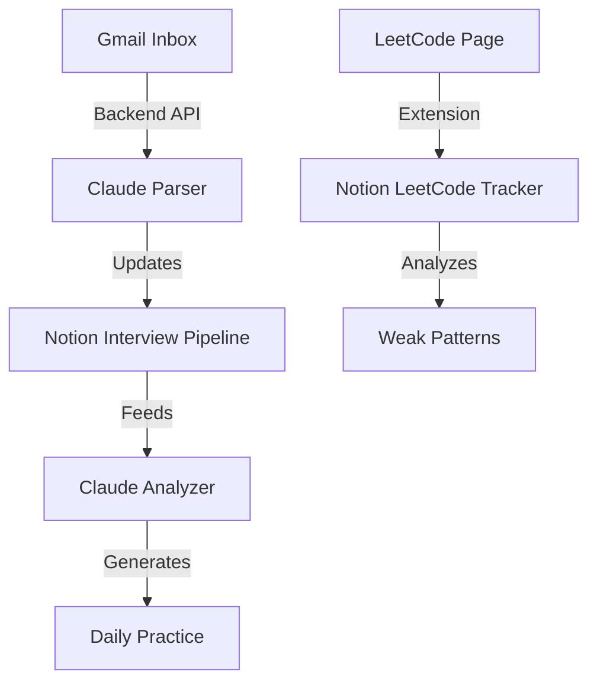

# Interview Protocol

A unified system for managing recruiting pipeline, LeetCode preparation, and interview readiness.

**Status:** In development (Week 1: Foundation learning complete)

## Overview

Interview Protocol orchestrates three core data streams:
1. **LeetCode submissions** — Track problems solved, identify weak patterns
2. **Gmail recruiter emails** — Auto-sync interview status and dates
3. **Personalized prep** — Claude-powered recommendations based on your weaknesses

## Architecture

### Data Flow

### Core Components

- **Browser Extension** — Syncs LeetCode submissions to Notion (one-click)
- **Gmail Integration** — Parses recruiter emails, auto-updates Notion pipeline
- **Claude Analyzer** — Detects weak patterns, generates daily sparring problems
- **Notion Hub** — Central database connecting all data streams

## Notion Databases

- **LeetCode Tracker** — Problem name, difficulty, topics, date solved, company tags, bug patterns, performance metrics
- **Interview Pipeline** — Companies, status, interview dates, prep progress, linked problems
- **Weak Patterns** — Recurring mistakes, frequency, examples
- **Daily Sparring** — Auto-generated daily problem sets targeting weak spots

## Tech Stack

**Frontend:**
- Chrome Extension (Manifest V3)
- Notion API

**Backend:**
- Node.js + Express
- Gmail API
- Anthropic Claude API
- Notion API

**Deployment:**
- Vercel (backend)
- Chrome Web Store (extension)

## Learning Path

- **Week 1:** Foundations (OAuth, REST APIs, environment variables, Notion setup)
- **Week 2:** Browser extension (LeetCode → Notion sync)
- **Week 3:** Gmail integration (recruiter email → Notion)
- **Week 4:** Claude analyzer (pattern detection + recommendations)
- **Week 5+:** Polish, deploy, portfolio documentation

## Setup

(Coming soon)

## Contributing

This is a personal project, but the architecture is documented for learning/interview purposes.